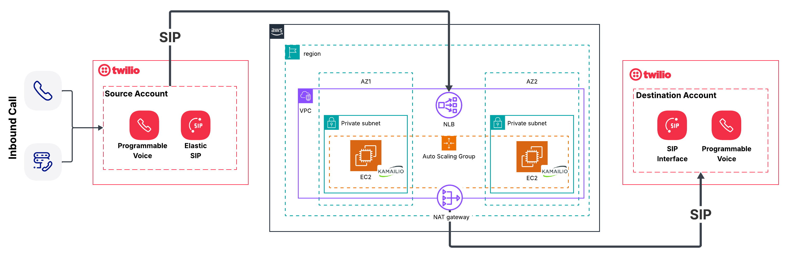

# Kamailio SIP Proxy for Twilio-to-Twilio Routing

Production-ready Kamailio-based SIP proxy to route calls between two Twilio accounts. Choose between a simple single-instance deployment or a production-grade auto-scaling architecture.

## Table of Contents

- [How It Works](#how-it-works)
- [Architecture Options](#architecture-options)
- [Quick Start](#quick-start)
- [Configuration](#configuration)
- [Project Structure](#project-structure)
- [Cost Breakdown](#cost-breakdown)
- [Capacity & Scalability](#capacity--scalability)
- [CloudWatch Monitoring & Alerting](#cloudwatch-monitoring--alerting)
- [Prerequisites](#prerequisites)
- [Monitoring](#monitoring)
- [Troubleshooting](#troubleshooting)
- [Technical Deep Dive](#technical-deep-dive)
- [Learnings & Gotchas](#learnings--gotchas)

## How It Works

This proxy enables call routing between separate Twilio accounts while preserving SIP signaling and allowing media (RTP) to remain on Twilio infrastructure.

### Call Flow

```
┌─────────────────────────────────────────────────────────────────────────┐
│                            SIP Call Flow                                │
└─────────────────────────────────────────────────────────────────────────┘

  ┌──────────────────┐                                  ┌─────────────────┐
  │  Source Twilio   │                                  │ Destination     │
  │  Phone Number    │                                  │ Twilio Account  │
  │ +1-555-555-1212  │                                  │ (SIP Domain)    │
  └────────┬─────────┘                                  └────────▲────────┘
           │                                                     │
           │ ① User calls                                       │
           │                                                     │
           │ ② INVITE sip:ext@<PROXY_IP>:5060                   │
           │                                                     │
           ▼                                                     │
  ┌─────────────────────────────────────────────────┐           │
  │         Kamailio SIP Proxy (This Project)       │           │
  │                                                 │           │
  │  ③ Receives INVITE from source Twilio          │          │
  │  ④ Rewrites Request-URI:                       │          │
  │     FROM: sip:ext@34.197.219.1                  │          │
  │     TO:   sip:ext@destination.sip.twilio.com    │          │
  │  ⑤ Adds Record-Route header                    │          │
  │     (stays in signaling path for ACK/BYE)       │          │
  └───────────┬──────────────────────────▲──────────┘          │
              │                          │                      │
              │ ⑥ INVITE sip:ext@destination.sip.twilio.com    │
              └──────────────────────────┼──────────────────────┘
                                         │
                          ⑦ Destination authenticates via IP ACL
                          ⑧ 100 Trying → 180 Ringing → 200 OK
                                         │
              ┌──────────────────────────┘
              │
              │ ⑨ Responses routed back via Via headers
              │
              ▼
  ┌──────────────────┐
  │  Source Twilio   │
  │ (Call Connected) │
  └──────────────────┘

┌─────────────────────────────────────────────────────────────────────────┐
│ Media (RTP) Flow: Direct between Twilio endpoints - NOT through proxy   │
│ Signaling Path: Source ←→ Proxy ←→ Destination (ACK, BYE)               │
└─────────────────────────────────────────────────────────────────────────┘
```

### Key Features

**What Kamailio Does:**
- Stateless SIP proxy (no call state stored)
- Request-URI rewriting (IP address → destination Twilio FQDN)
- Via header management (adds on outbound, removes on inbound)
- Record-Route for in-dialog requests (ACK, BYE)
- Proper response routing following Via header stack

**What Kamailio Does NOT Do:**
- Media processing (RTP stays between Twilio endpoints)
- Call recording or transcoding
- Authentication (handled by Twilio IP ACLs)
- Call state persistence

## Architecture Options

### Single EC2 - Simple & Fast

Perfect for proof-of-concept, testing, and low-volume production use.

```
┌─────────────────────────────────────┐
│         Internet                    │
└─────────────┬───────────────────────┘
              │
    ┌─────────▼────────────┐
    │   Elastic IP         │
    │  (34.197.219.1)      │
    └─────────┬────────────┘
              │
    ┌─────────▼────────────┐
    │  Public Subnet       │
    │  (10.0.0.0/20)       │
    │                      │
    │  ┌────────────────┐  │
    │  │ EC2 t3.small   │  │
    │  │ Kamailio       │  │
    │  └────────────────┘  │
    └──────────────────────┘
```

**Architecture Diagram:**


**Characteristics:**
- 1 EC2 instance with 1 Elastic IP
- Deployment time: 3-5 minutes
- Cost: ~$15/month
- Single AZ (us-east-1a)
- No auto-scaling or load balancing
- Session Manager access (no SSH)

**Best for:**
- Proof of concept
- Development and testing
- Low call volume (<50 concurrent)
- Learning Kamailio configuration
- Budget-conscious deployments

[→ Single EC2 Documentation](./single-ec2/README.md)

### Load Balanced - Production Ready

Production-grade deployment with high availability, auto-scaling, and zero-downtime updates.

```
                    Internet
                       |
     ┌─────────────────┴─────────────────┐
     ↓ (inbound)                         ↓ (outbound)
[NLB - EIP 1]                    [NAT Gateway - EIP 2]
(Public Subnet)                   (Public Subnet)
     ↓                                    ↑
  Private Subnet (us-east-1a)            |
     ↓                                    |
  Kamailio Instances ──────────────────→ |
  (Auto Scaling: 2-10)
  - No public IPs
  - Inbound via NLB
  - Outbound via NAT Gateway
```

**Architecture Diagram:**



**Two Elastic IPs:**
- **NLB EIP**: Inbound traffic from source Twilio (configure in source TwiML)
- **NAT Gateway EIP**: Outbound traffic to destination Twilio (whitelist in destination IP ACL)

**Characteristics:**
- 2-10 EC2 instances (auto-scaling)
- Network Load Balancer with sticky sessions
- Deployment time: 5-10 minutes
- Cost: ~$45-75/month (with NAT Gateway)
- Multi-AZ support (3 AZs)
- Automatic failure recovery
- Zero-downtime rolling updates
- CloudWatch metrics and alarms

**Best for:**
- Production workloads
- High availability requirements (99.9%+)
- Variable/unknown call volume
- Zero-downtime deployment requirements
- Enterprise deployments

[→ Load Balanced Documentation](./load-balanced/README.md)

## Quick Start

### 1. Choose Your Architecture

**Starting out?** Use `single-ec2` first to validate the concept.

**Going to production?** Deploy `load-balanced` for high availability.

### 2. Deploy Single EC2 (POC)

```bash
cd single-ec2/terraform
cp terraform.tfvars.example terraform.tfvars

# Edit terraform.tfvars and set BOTH required variables:
# 1. aws_profile = "your-profile-name"
# 2. destination_twilio_domain = "your-account.sip.twilio.com" (uncomment this line!)

terraform init
terraform plan
terraform apply
```

### 3. Deploy Load Balanced (Production)

```bash
cd load-balanced/terraform
cp terraform.tfvars.example terraform.tfvars

# Edit terraform.tfvars and set BOTH required variables:
# 1. aws_profile = "your-profile-name"
# 2. destination_twilio_domain = "your-account.sip.twilio.com" (uncomment this line!)
# Optional: Adjust asg_min_size, asg_max_size, instance_type

terraform init
terraform plan
terraform apply
```

### 4. Configure Twilio

**Destination Twilio Account:**
1. Go to Voice → Manage → SIP domains and select the domain you entered in terraform.tfvars 
2. Click the "+" icon next to "IP ACCESS CONTROL LISTS"
3. Add proxy IP with `/32` CIDR:
   - Single EC2: Use `elastic_ip` from Terraform output
   - Load Balanced: Use `nat_gateway_ip` from Terraform output (NOT the NLB IP!)
4. Click "Create ACL"
5. Click "Save" at the bottom of the page. 

**Source Twilio Account:**

For quick testing, you can use the proxy IP address directly. **For production deployments, use a domain name instead** (see "Using a Domain Name for Production" below).

1. Go to Phone Numbers → Select your number
2. Under Voice & Fax, use TwiML:

   **Option A: IP Address (Quick Start)**
   ```xml
   <Response>
     <Dial>
       <Sip>sip:EXTENSION@<PROXY_IP>:5060</Sip>
     </Dial>
   </Response>
   ```
   - Single EC2: Use `elastic_ip` from output
   - Load Balanced: Use `nlb_elastic_ip` from output

   **Option B: Domain Name (Production)**
   ```xml
   <Response>
     <Dial>
       <Sip>sip:EXTENSION@sip-proxy.yourcompany.com:5060</Sip>
     </Dial>
   </Response>
   ```

#### Using a Domain Name for Production

While using the proxy IP address directly works, **using a domain name is strongly recommended for production** deployments.

**Benefits:**
- **Flexibility**: Change infrastructure (IP addresses, architectures) without updating TwiML
- **Disaster recovery**: Update DNS to point to backup infrastructure
- **Professional**: More readable and maintainable than IP addresses
- **Future-proof**: Enables TLS/SIPS support and multi-environment setups (dev/staging/prod)

**Basic Setup with Route53:**

1. **Register or use existing domain** (e.g., yourcompany.com)

2. **Create A record in Route53:**
   ```bash
   # Via AWS Console:
   Route53 → Hosted Zones → Select your domain → Create Record

   Record name: sip-proxy (creates sip-proxy.yourcompany.com)
   Record type: A
   Value: <PROXY_ELASTIC_IP>
   TTL: 300 seconds (5 minutes)
   ```

3. **Get the correct IP:**
   - Single EC2: Use `elastic_ip` from Terraform output
   - Load Balanced: Use `nlb_elastic_ip` from Terraform output

4. **Update your TwiML** to use the domain name instead of IP

5. **Test DNS resolution:**
   ```bash
   dig sip-proxy.yourcompany.com
   # Should return your proxy's Elastic IP
   ```

**Cost:** Route53 hosted zone costs ~$0.50/month + ~$0.40/month per million queries (negligible for SIP traffic).

For more details on Route53 configuration, see [AWS Route53 Documentation](https://docs.aws.amazon.com/route53/).

### 5. Test

Make a test call to your source Twilio number. The call should route through the proxy to your destination Twilio SIP domain.

## Configuration

### Required Terraform Variables

Both architectures require these variables in `terraform.tfvars`:

```hcl
# Required: AWS profile from ~/.aws/credentials
aws_profile = "your-profile-name"

# Required: Destination Twilio SIP domain
destination_twilio_domain = "your-account.sip.twilio.com"
```

### Optional Terraform Variables

```hcl
# AWS region (default: us-east-1)
aws_region = "us-east-1"

# EC2 instance type (default: t3.small)
instance_type = "t3.small"

# For load-balanced only:
asg_min_size = 2          # Minimum instances
asg_max_size = 10         # Maximum instances
asg_desired_capacity = 2  # Desired instances

# Twilio IP ranges (update if using different regions)
twilio_ip_cidrs = [
  "54.172.60.0/23",   # us-east-1 (primary)
  "54.244.51.0/24",   # us-west-2
  "177.71.206.0/23"   # São Paulo
]
```

### Configuring Twilio IP Ranges

Kamailio filters incoming INVITE requests by source IP to only accept traffic from Twilio. The default configuration includes IPs for:
- `54.172.60.0/23` - US East (Virginia)
- `54.244.51.0/24` - US West (Oregon)
- `177.71.206.0/23` - South America (São Paulo)

**To add more regions:**

1. Find current Twilio IP ranges: https://www.twilio.com/docs/sip-trunking/ip-addresses
2. Update `twilio_ip_cidrs` in your `terraform.tfvars`:
   ```hcl
   twilio_ip_cidrs = [
     "54.172.60.0/23",   # US East
     "54.244.51.0/24",   # US West
     "177.71.206.0/23",  # South America
     "54.65.63.192/26",  # Asia Pacific (Tokyo) - EXAMPLE
     "54.252.254.64/26"  # Asia Pacific (Sydney) - EXAMPLE
   ]
   ```
3. Run `terraform apply` to update security groups

The Kamailio configuration (in `config/kamailio.cfg`) also filters by IP regex patterns. If you add new IP ranges that don't match the existing patterns (`^54\.172\.`, `^54\.244\.`, `^177\.71\.`), you'll need to update the Kamailio config as well.

### Changing Destination Twilio Domain

To route calls to a different destination Twilio account:

1. Update `destination_twilio_domain` in `terraform.tfvars`:
   ```hcl
   destination_twilio_domain = "new-account.sip.twilio.com"
   ```

2. Apply the change:
   ```bash
   terraform apply
   ```

For **single-ec2**, this recreates the instance with new configuration (1-2 minutes downtime).

For **load-balanced**, this triggers a rolling instance refresh (zero downtime, maintains 50% healthy capacity).

## Project Structure

```
kamailio-proxy/
├── single-ec2/                  # Simple single-instance deployment
│   ├── terraform/
│   │   ├── main.tf             # Provider & backend config
│   │   ├── variables.tf        # Variable definitions
│   │   ├── vpc.tf              # VPC, subnet, IGW
│   │   ├── security_groups.tf  # Security groups for SIP
│   │   ├── ec2.tf              # EC2 instance + Elastic IP
│   │   ├── iam.tf              # IAM roles for Session Manager
│   │   ├── outputs.tf          # Elastic IP and instructions
│   │   └── terraform.tfvars    # Your configuration (gitignored)
│   ├── config/
│   │   └── kamailio.cfg        # Kamailio configuration template
│   ├── scripts/
│   │   └── user-data.sh        # EC2 initialization script
│   └── README.md
│
├── load-balanced/               # Production auto-scaling deployment
│   ├── terraform/
│   │   ├── main.tf             # Provider & backend config
│   │   ├── variables.tf        # Variable definitions
│   │   ├── vpc.tf              # VPC, subnets, NAT Gateway
│   │   ├── security_groups.tf  # Security groups for SIP + NLB
│   │   ├── nlb.tf              # Network Load Balancer
│   │   ├── asg.tf              # Auto Scaling Group + policies
│   │   ├── iam.tf              # IAM roles for Session Manager
│   │   ├── outputs.tf          # NLB IP, NAT IP, instructions
│   │   └── terraform.tfvars    # Your configuration (gitignored)
│   ├── config/
│   │   └── kamailio.cfg        # Kamailio configuration template
│   ├── scripts/
│   │   └── user-data.sh        # EC2 initialization script
│   └── README.md
│
├── CLAUDE.md                    # Guidance for AI assistants
└── README.md                    # This file
```

## Cost Breakdown

### Single EC2

| Resource | Cost |
|----------|------|
| EC2 t3.small (730 hrs/mo) | ~$15/month |
| Elastic IP (attached) | Free |
| Data transfer (SIP signaling) | <$1/month |
| **Total** | **~$15/month** |

### Load Balanced

| Resource | Cost |
|----------|------|
| 2× EC2 t3.small (730 hrs/mo) | ~$30/month |
| Network Load Balancer (base) | ~$16/month |
| NLB data processed (minimal) | ~$1-3/month |
| NAT Gateway (base) | ~$32/month |
| NAT Gateway data processed | ~$1-3/month |
| 2× Elastic IPs (attached) | Free |
| **Total** | **~$45-75/month** |

**Cost Optimization Tips:**
- Use t3.micro for very light traffic (~$7/month per instance)
- Single AZ deployment reduces NAT Gateway cost (loses multi-AZ redundancy)
- Spot Instances can reduce instance costs by 70% (risky for production)

## Capacity & Scalability

### Expected Call Volume

SIP signaling is extremely lightweight compared to media processing. The proxy only handles SIP messages (INVITE, ACK, BYE, etc.) - media (RTP) flows directly between Twilio endpoints.

**Typical SIP Message Sizes:**
- INVITE with SDP: 800-1500 bytes
- Response (180 Ringing, 200 OK): 500-800 bytes
- ACK/BYE: 300-500 bytes

**Call Setup Sequence:**
```
INVITE → 100 Trying → 180 Ringing → 200 OK → ACK
(~5 messages, ~4KB total, ~2-3 seconds)
```

### Single EC2 (t3.small: 2 vCPU, 2GB RAM)

**Concurrent Calls:**
- **Conservative**: 150-200 concurrent calls
- **Aggressive**: 300-400 concurrent calls
- **Tested**: 100 concurrent calls with <10% CPU utilization

**Calls Per Second (CPS):**
- **Sustained**: 20-30 CPS (call setups per second)
- **Burst**: 50-75 CPS for short periods

**Bottlenecks:**
- CPU: SIP message parsing and transaction management
- Network: Not typically a bottleneck (SIP is lightweight)
- Memory: Minimal (stateless proxy with minimal state)

**When to Upgrade:**
- Sustained CPU > 70% during normal traffic
- Latency increases (check Kamailio logs for slow processing)
- Need high availability (single point of failure)

**Recommended Usage:**
- Development/testing: Unlimited
- POC: Up to 50 concurrent calls
- Light production: Up to 100 concurrent calls
- If you exceed 100 concurrent regularly, migrate to load-balanced

### Load Balanced (2-10 × t3.small)

**Concurrent Calls (2 instances minimum):**
- **Conservative**: 300-400 concurrent calls
- **Aggressive**: 600-800 concurrent calls

**Concurrent Calls (10 instances maximum):**
- **Conservative**: 1,500-2,000 concurrent calls
- **Aggressive**: 3,000-4,000 concurrent calls

**Calls Per Second (CPS):**
- **Per instance**: 20-30 CPS sustained
- **2 instances**: 40-60 CPS sustained
- **10 instances**: 200-300 CPS sustained
- **Burst**: 2-3x sustained rate for short periods

**Auto-Scaling Behavior:**
- Scales out when CPU > 70% or Network In > 50 MB/s
- Scales in when both metrics drop below thresholds
- New instance becomes healthy in ~5 minutes
- Scaling up takes 5-7 minutes (launch + health checks)
- Scaling down is gradual (connection draining)

**Real-World Capacity Estimates:**

| Scenario | Avg Call Duration | CPS Needed | Concurrent Calls | Recommended Config |
|----------|------------------|------------|------------------|-------------------|
| Small call center | 3 minutes | 5-10 CPS | 100-200 | 2 instances (min) |
| Medium call center | 5 minutes | 10-20 CPS | 300-600 | 3-5 instances |
| Large call center | 8 minutes | 30-50 CPS | 1,500-2,500 | 6-10 instances |
| Enterprise | 10 minutes | 50-100 CPS | 3,000-6,000 | 10+ instances (increase max) |

**Formula for Concurrent Calls:**
```
Concurrent Calls = CPS × Average Call Duration (seconds)
Example: 20 CPS × 300 seconds = 600 concurrent calls
```

**Bottlenecks:**
- NLB: Handles millions of requests/second (not a bottleneck)
- NAT Gateway: 45 Gbps bandwidth (not a bottleneck for SIP)
- Instance CPU: Primary bottleneck (scales horizontally)
- ASG max_size: Artificial limit (default 10, increase if needed)

**When to Increase max_size:**
- Consistently hitting 10 instances during normal traffic
- Need more capacity for growth
- Update `asg_max_size` in terraform.tfvars

**Instance Type Recommendations:**

| Instance Type | vCPU | RAM | Concurrent Calls | Cost/month | Use Case |
|--------------|------|-----|------------------|------------|----------|
| t3.micro | 2 | 1GB | 50-75 | ~$7 | Very light traffic |
| t3.small | 2 | 2GB | 150-200 | ~$15 | Standard (recommended) |
| t3.medium | 2 | 4GB | 150-200* | ~$30 | Not needed (RAM not bottleneck) |
| c5.large | 2 | 4GB | 200-300 | ~$61 | High CPS requirements |
| c5.xlarge | 4 | 8GB | 400-600 | ~$122 | Very high CPS (50+ sustained) |

*t3.medium offers no SIP capacity benefit over t3.small (CPU is the same, extra RAM unused)

**Recommendation:** Start with t3.small and scale horizontally. Only consider compute-optimized instances (c5.large+) if you need >30 CPS per instance sustained.

## CloudWatch Monitoring & Alerting

### Recommended Monitoring Setup (Load Balanced)

The load-balanced architecture generates metrics across multiple AWS services. Setting up CloudWatch monitoring and alarms helps detect issues before they impact calls.

#### Key Metrics to Monitor

**1. Auto Scaling Group Metrics**
```
Namespace: AWS/AutoScaling
```
- `GroupDesiredCapacity` - How many instances ASG wants
- `GroupInServiceInstances` - How many instances are healthy
- `GroupMinSize` / `GroupMaxSize` - Scaling limits
- `GroupPendingInstances` - Instances launching
- `GroupTerminatingInstances` - Instances shutting down

**2. Network Load Balancer Metrics**
```
Namespace: AWS/NetworkELB
```
- `ActiveFlowCount` - Number of active connections
- `ProcessedBytes` - Total data processed
- `HealthyHostCount` - Number of healthy targets
- `UnHealthyHostCount` - Number of unhealthy targets
- `NewFlowCount` - New connections per minute

**3. Target Group Metrics**
```
Namespace: AWS/NetworkELB (filtered by TargetGroup)
```
- `HealthyHostCount` - Healthy instances in target group
- `UnHealthyHostCount` - Unhealthy instances
- `TargetResponseTime` - Not applicable for UDP (TCP health checks only)

**4. EC2 Instance Metrics**
```
Namespace: AWS/EC2
```
- `CPUUtilization` - Per-instance CPU usage
- `NetworkIn` / `NetworkOut` - Network traffic
- `StatusCheckFailed` - Instance health

#### Critical Alarms to Create

**1. Unhealthy Instances Alarm**
```hcl
# In Terraform or AWS Console
resource "aws_cloudwatch_metric_alarm" "unhealthy_hosts" {
  alarm_name          = "kamailio-lb-unhealthy-hosts"
  comparison_operator = "GreaterThanThreshold"
  evaluation_periods  = 2
  metric_name         = "UnHealthyHostCount"
  namespace           = "AWS/NetworkELB"
  period              = 60
  statistic           = "Average"
  threshold           = 0
  alarm_description   = "Alert when any target is unhealthy"
  alarm_actions       = [aws_sns_topic.alerts.arn]

  dimensions = {
    LoadBalancer = aws_lb.kamailio.arn_suffix
    TargetGroup  = aws_lb_target_group.kamailio.arn_suffix
  }
}
```

**Why:** Unhealthy instances indicate configuration issues, failed health checks, or Kamailio crashes. Requires immediate investigation.

**2. Minimum Healthy Instances Alarm**
```hcl
resource "aws_cloudwatch_metric_alarm" "min_healthy_hosts" {
  alarm_name          = "kamailio-lb-min-healthy-hosts"
  comparison_operator = "LessThanThreshold"
  evaluation_periods  = 2
  metric_name         = "HealthyHostCount"
  namespace           = "AWS/NetworkELB"
  period              = 60
  statistic           = "Average"
  threshold           = 2  # Alarm if less than 2 healthy
  alarm_description   = "Alert when healthy instance count drops below minimum"
  alarm_actions       = [aws_sns_topic.alerts.arn]

  dimensions = {
    LoadBalancer = aws_lb.kamailio.arn_suffix
    TargetGroup  = aws_lb_target_group.kamailio.arn_suffix
  }
}
```

**Why:** If healthy instances drop below minimum, you lose redundancy. One more failure causes complete outage.

**3. High CPU Utilization Alarm**
```hcl
resource "aws_cloudwatch_metric_alarm" "high_cpu" {
  alarm_name          = "kamailio-lb-high-cpu"
  comparison_operator = "GreaterThanThreshold"
  evaluation_periods  = 3
  metric_name         = "CPUUtilization"
  namespace           = "AWS/EC2"
  period              = 300  # 5 minutes
  statistic           = "Average"
  threshold           = 80
  alarm_description   = "Alert when CPU is consistently high"
  alarm_actions       = [aws_sns_topic.alerts.arn]

  dimensions = {
    AutoScalingGroupName = aws_autoscaling_group.kamailio.name
  }
}
```

**Why:** Sustained high CPU indicates capacity issues. While auto-scaling will add instances, you should verify it's scaling correctly and consider increasing max_size if hitting limits.

**4. Approaching Max Capacity Alarm**
```hcl
resource "aws_cloudwatch_metric_alarm" "near_max_capacity" {
  alarm_name          = "kamailio-lb-near-max-capacity"
  comparison_operator = "GreaterThanOrEqualToThreshold"
  evaluation_periods  = 2
  metric_name         = "GroupDesiredCapacity"
  namespace           = "AWS/AutoScaling"
  period              = 300
  statistic           = "Average"
  threshold           = 8  # Alarm when at 8 of 10 max
  alarm_description   = "Alert when approaching max ASG capacity"
  alarm_actions       = [aws_sns_topic.alerts.arn]

  dimensions = {
    AutoScalingGroupName = aws_autoscaling_group.kamailio.name
  }
}
```

**Why:** If you're consistently hitting max capacity, you need to increase `asg_max_size` to allow further scaling.

**5. Zero Healthy Instances Alarm**
```hcl
resource "aws_cloudwatch_metric_alarm" "no_healthy_hosts" {
  alarm_name          = "kamailio-lb-no-healthy-hosts"
  comparison_operator = "LessThanOrEqualToThreshold"
  evaluation_periods  = 1  # Immediate alert
  metric_name         = "HealthyHostCount"
  namespace           = "AWS/NetworkELB"
  period              = 60
  statistic           = "Average"
  threshold           = 0
  alarm_description   = "CRITICAL: No healthy instances available"
  alarm_actions       = [aws_sns_topic.critical_alerts.arn]

  dimensions = {
    LoadBalancer = aws_lb.kamailio.arn_suffix
    TargetGroup  = aws_lb_target_group.kamailio.arn_suffix
  }
}
```

**Why:** Complete outage. All calls will fail. Requires immediate response.

#### SNS Topics for Notifications

**Create SNS Topics:**
```hcl
# Standard alerts (email, Slack)
resource "aws_sns_topic" "alerts" {
  name = "kamailio-lb-alerts"
}

resource "aws_sns_topic_subscription" "alerts_email" {
  topic_arn = aws_sns_topic.alerts.arn
  protocol  = "email"
  endpoint  = "ops-team@example.com"
}

# Critical alerts (PagerDuty, phone)
resource "aws_sns_topic" "critical_alerts" {
  name = "kamailio-lb-critical-alerts"
}

resource "aws_sns_topic_subscription" "critical_pagerduty" {
  topic_arn = aws_sns_topic.critical_alerts.arn
  protocol  = "https"
  endpoint  = "https://events.pagerduty.com/integration/YOUR_KEY/enqueue"
}
```

#### CloudWatch Dashboard

**Create a centralized dashboard:**

```hcl
resource "aws_cloudwatch_dashboard" "kamailio" {
  dashboard_name = "kamailio-lb-dashboard"

  dashboard_body = jsonencode({
    widgets = [
      {
        type = "metric"
        properties = {
          metrics = [
            ["AWS/NetworkELB", "HealthyHostCount", {stat = "Average"}],
            [".", "UnHealthyHostCount", {stat = "Average"}]
          ]
          period = 60
          stat = "Average"
          region = "us-east-1"
          title = "Target Health"
        }
      },
      {
        type = "metric"
        properties = {
          metrics = [
            ["AWS/AutoScaling", "GroupDesiredCapacity"],
            [".", "GroupInServiceInstances"],
            [".", "GroupMaxSize"]
          ]
          period = 300
          stat = "Average"
          region = "us-east-1"
          title = "Auto Scaling Capacity"
        }
      },
      {
        type = "metric"
        properties = {
          metrics = [
            ["AWS/EC2", "CPUUtilization", {stat = "Average"}]
          ]
          period = 300
          stat = "Average"
          region = "us-east-1"
          title = "Average CPU Utilization"
        }
      },
      {
        type = "metric"
        properties = {
          metrics = [
            ["AWS/NetworkELB", "ActiveFlowCount"],
            [".", "NewFlowCount"]
          ]
          period = 60
          stat = "Sum"
          region = "us-east-1"
          title = "Connection Metrics"
        }
      }
    ]
  })
}
```

#### Custom Metrics (Optional)

For more detailed SIP-specific metrics, you can configure Kamailio to send custom metrics:

**Example: Track Call Success Rate**
- Parse Kamailio logs for INVITE and response codes
- Send to CloudWatch using AWS CLI or CloudWatch agent
- Create alarms for success rate < 95%

**Example: Track Call Setup Latency**
- Measure time between INVITE and 200 OK
- Log to CloudWatch custom metric
- Alert if P99 latency > 5 seconds

**Implementation:**
```bash
# In user-data.sh or separate monitoring script
# Parse Kamailio logs and push metrics
aws cloudwatch put-metric-data \
  --namespace "Kamailio" \
  --metric-name "CallsPerMinute" \
  --value $CALL_COUNT \
  --dimensions Instance=$INSTANCE_ID
```

#### Monitoring Checklist

**After Deployment:**
- [ ] Verify all instances are healthy in target group
- [ ] Check CloudWatch dashboard shows expected metrics
- [ ] Test alarms by manually stopping Kamailio on one instance
- [ ] Verify SNS notifications reach correct channels
- [ ] Document runbook for responding to alerts

**Weekly:**
- [ ] Review CloudWatch dashboard for trends
- [ ] Check scaling history for unexpected events
- [ ] Verify auto-scaling is working as expected

**Monthly:**
- [ ] Review alarm thresholds (adjust based on actual traffic)
- [ ] Check for false positives or missed alerts
- [ ] Update documentation based on incidents

#### Cost of Monitoring

**CloudWatch Costs:**
- Metrics: First 10 custom metrics free, then $0.30/metric/month
- Alarms: First 10 free, then $0.10/alarm/month
- Dashboard: $3/month per dashboard
- Logs: $0.50/GB ingested (if using CloudWatch Logs)

**Estimated Monitoring Cost:**
- 5 alarms (free)
- 1 dashboard: $3/month
- **Total: ~$3/month**

#### Integration with Incident Response Tools

**PagerDuty:**
- Create SNS topic → PagerDuty integration
- Route critical alarms to on-call engineer
- Automatic escalation if not acknowledged

**Slack:**
- Use AWS Chatbot for Slack integration
- Route alarms to #ops-alerts channel
- Include runbook links in notifications

**OpsGenie:**
- SNS → OpsGenie webhook
- Create incidents with context
- Schedule-based routing

#### Recommended Terraform Module Structure

```
load-balanced/terraform/
├── monitoring.tf         # CloudWatch alarms and dashboard
├── sns.tf               # SNS topics and subscriptions
└── variables.tf         # Add monitoring-related variables
```

**Add to terraform.tfvars:**
```hcl
# Monitoring configuration
alert_email = "ops-team@example.com"
pagerduty_endpoint = "https://events.pagerduty.com/integration/YOUR_KEY/enqueue"
enable_critical_alerts = true
```

This monitoring setup provides visibility into system health, capacity, and performance, enabling proactive issue detection and faster incident response.

## Prerequisites

### AWS Requirements

1. **AWS Account** with permissions to create:
   - VPC, subnets, route tables, internet gateway
   - EC2 instances, security groups
   - Elastic IPs
   - IAM roles and instance profiles
   - (Load balanced only) Network Load Balancer, Target Groups, Auto Scaling Groups, NAT Gateway

2. **AWS CLI** configured with profile:
   ```bash
   aws configure --profile your-profile-name
   ```

3. **Terraform** installed (v1.0 or later):
   ```bash
   terraform --version
   ```

### Twilio Requirements

1. **Source Twilio Account** with:
   - Phone number to receive test calls
   - TwiML Bin or configured webhook

2. **Destination Twilio Account** with:
   - SIP Domain configured (e.g., `your-account.sip.twilio.com`)
   - IP Access Control List ready to whitelist proxy IP

## Monitoring

### Single EC2

**Access Instance:**
```bash
# Via AWS Console:
EC2 → Instances → Select instance → Connect → Session Manager
```

**Check Kamailio Status:**
```bash
sudo systemctl status kamailio
```

**View Live Logs:**
```bash
# SIP message logs
sudo tail -f /var/log/syslog | grep kamailio

# User-data script execution
sudo tail -f /var/log/cloud-init-output.log
```

**Capture SIP Traffic:**
```bash
# Live capture with headers
sudo tcpdump -i any port 5060 -n -vv -A

# Save to file
sudo tcpdump -i any port 5060 -n -s0 -w /tmp/sip-capture.pcap

# Alternative Live Capture Tool
sudo sngrep
```

### Load Balanced

**AWS Console Monitoring:**

1. **Auto Scaling Group:**
   ```
   EC2 → Auto Scaling Groups → kamailio-lb-asg
   ```
   - View instance count and health
   - See scaling history and activities
   - Adjust min/max/desired capacity

2. **Network Load Balancer:**
   ```
   EC2 → Load Balancers → kamailio-lb-nlb
   ```
   - View traffic metrics
   - Check health status

3. **Target Group:**
   ```
   EC2 → Target Groups → kamailio-lb-tg
   ```
   - See healthy/unhealthy instance counts
   - View health check details

**CloudWatch Metrics:**
- `GroupDesiredCapacity` - Number of instances ASG wants
- `GroupInServiceInstances` - Number of healthy instances
- `ActiveFlowCount` - Active connections through NLB
- `HealthyHostCount` - Healthy targets in target group
- `UnHealthyHostCount` - Unhealthy targets

**Access Any Instance:**
```bash
# Via AWS Console:
EC2 → Instances → Select instance → Connect → Session Manager

# Then same commands as single-ec2:
sudo systemctl status kamailio
sudo tail -f /var/log/syslog | grep kamailio
```

## Troubleshooting

### Call Fails with "Request Timeout" (No Response)

**Symptoms:**
- Twilio shows "Request timeout" error
- No 100 Trying or other responses received

**Check:**
1. Is Kamailio running?
   ```bash
   sudo systemctl status kamailio
   ```

2. Are security groups allowing UDP 5060 from Twilio IPs?
   ```bash
   # Check instance security group in AWS Console
   # Should show: UDP 5060 from Twilio CIDR blocks
   ```

3. Is Kamailio listening on the correct port?
   ```bash
   sudo netstat -ulnp | grep 5060
   # Should show: udp 0 0 <PRIVATE_IP>:5060
   ```

4. Did user-data script complete successfully?
   ```bash
   sudo tail -n 100 /var/log/cloud-init-output.log
   # Look for "Setup Complete" message
   ```

**Fix:**
- Restart Kamailio: `sudo systemctl restart kamailio`
- Verify Twilio IP ranges in security group match your source Twilio region
- Check Kamailio config: `sudo cat /etc/kamailio/kamailio.cfg | grep listen`

### Call Fails with "403 Forbidden"

**Symptoms:**
- Kamailio receives INVITE (logs show it)
- Destination Twilio rejects with 403 Forbidden
- Kamailio returns 403 to source Twilio

**Check:**
1. Is proxy IP whitelisted in destination Twilio IP ACL?
   - Single EC2: Check Elastic IP is in ACL
   - Load Balanced: Check NAT Gateway IP is in ACL (NOT the NLB IP!)

2. Is destination domain correct?
   ```bash
   sudo grep "DESTINATION" /etc/kamailio/kamailio.cfg
   ```

**Fix:**
- Add correct IP to destination Twilio IP ACL with `/32` CIDR
- Verify destination domain in Terraform: `destination_twilio_domain = "your-account.sip.twilio.com"`

### Load Balanced: Instances Unhealthy in Target Group

**Symptoms:**
- All instances show "Unhealthy" in target group
- ASG keeps launching and terminating instances

**Check:**
1. Is Kamailio listening on TCP port 5060? (health checks use TCP)
   ```bash
   sudo netstat -tlnp | grep 5060
   # Should show: tcp 0 0 <PRIVATE_IP>:5060
   ```

2. Are security groups allowing TCP 5060 from VPC CIDR?
   ```bash
   # Check security group in AWS Console
   # Should show: TCP 5060 from 10.0.0.0/16 (VPC CIDR)
   ```

3. Check Kamailio config has TCP enabled:
   ```bash
   sudo grep "disable_tcp\|listen=tcp" /etc/kamailio/kamailio.cfg
   ```

**Fix:**
- Kamailio config must have: `disable_tcp=no` and `listen=tcp:PRIVATE_IP:5060`
- Security group must allow TCP 5060 from VPC CIDR for health checks
- Apply Terraform changes and wait ~8-10 minutes for instances to stabilize

### Load Balanced: Instances Loop on Restart

**Symptoms:**
- Instances constantly launching and terminating
- Target group shows 0 healthy instances
- ASG scaling activities show repeated failures

**Root Cause:**
- Health checks failing → ASG terminates instance → Launches new instance → Health checks fail → Repeat

**Fix:**
1. Suspend ASG processes to stop the loop:
   ```bash
   aws autoscaling suspend-processes \
     --auto-scaling-group-name kamailio-lb-asg \
     --scaling-processes HealthCheck ReplaceUnhealthy
   ```

2. Access one of the instances via Session Manager

3. Debug why Kamailio/health checks are failing (see checks above)

4. Once fixed, resume ASG processes:
   ```bash
   aws autoscaling resume-processes \
     --auto-scaling-group-name kamailio-lb-asg
   ```

5. Or destroy and rebuild with correct configuration:
   ```bash
   terraform destroy
   terraform apply
   ```

### No Logs Appearing

**Check:**
1. Logs go to syslog, not a separate file initially:
   ```bash
   sudo grep kamailio /var/log/syslog | tail -n 50
   ```

2. If you need more detailed logs, increase debug level:
   ```bash
   # Edit kamailio.cfg to set: debug=4
   sudo systemctl restart kamailio
   ```

3. Check if rsyslog is running:
   ```bash
   sudo systemctl status rsyslog
   ```

## Technical Deep Dive

### Kamailio Configuration

Both architectures use the same Kamailio configuration logic:

**1. Request Filtering**
```kamailio
# Only accept INVITEs from Twilio IP ranges
if (is_method("INVITE") &&
    ($si =~ "^54\.172\." || $si =~ "^54\.244\." || $si =~ "^177\.71\.")) {
    # Process the INVITE
}
```

**2. Request-URI Rewriting**
```kamailio
# Extract user from Request-URI
$var(user) = $rU;

# Rewrite destination to Twilio FQDN
$ru = "sip:" + $var(user) + "@your-account.sip.twilio.com";
```

**3. Record-Route**
```kamailio
# Add Record-Route header with explicit public IP to stay in signaling path
# Note: Do NOT include "sip:" prefix - record_route_preset() adds it automatically
record_route_preset("ELASTIC_IP:5060");
```

**4. Transaction Relay**
```kamailio
# Forward request using transaction module
t_relay();
```

**5. Response Handling**
- Kamailio's transaction module (`tm.so`) automatically handles response routing
- Responses follow the Via header stack back to source Twilio
- No manual response routing needed

### AWS Networking

#### Single EC2

**Inbound Traffic:**
```
Source Twilio → Internet Gateway → Elastic IP → EC2 Instance
```

**Outbound Traffic:**
```
EC2 Instance → Internet Gateway → Destination Twilio
```

**Key Points:**
- EC2 has both private IP (10.0.x.x) and public IP (Elastic IP)
- Kamailio listens on private IP
- Kamailio advertises Elastic IP in Via headers
- Security group restricts UDP 5060 to Twilio IP ranges only

#### Load Balanced

**Inbound Traffic (Source Twilio → Proxy):**
```
Source Twilio → NLB (Public Subnet, EIP 1) → Instance (Private Subnet)
```

**Outbound Traffic (Proxy → Destination Twilio):**
```
Instance (Private Subnet) → NAT Gateway (Public Subnet, EIP 2) → Destination Twilio
```

**Key Points:**
- NLB preserves source IP (Twilio IP) when forwarding to instances
- Instances have NO public IPs, only private IPs
- Security group allows UDP 5060 from VPC CIDR (for NLB forwarding)
- Security group also allows UDP 5060 from Twilio IPs (for preserved source IPs)
- NAT Gateway provides single static IP for ALL outbound traffic
- Health checks use TCP (not UDP) because they need reliable acknowledgment

**Why Two Elastic IPs?**
- **EIP 1 (NLB)**: Source Twilio sends INVITEs here → configure in source TwiML
- **EIP 2 (NAT Gateway)**: Instances send INVITEs to destination Twilio from here → whitelist in destination IP ACL

**Why Private Subnets + NAT Gateway Work:**
- Inbound and outbound are SEPARATE traffic flows
- Inbound: Source Twilio → NLB → Instance → Response back through NLB (symmetric)
- Outbound: Instance → NAT Gateway → Destination Twilio → Response back through NAT Gateway (symmetric)
- No asymmetric routing because each flow has its own path

### Multi-Homed EC2 Configuration

Kamailio must handle instances with multiple IP addresses:

**Single EC2:**
- Private IP: 10.0.x.x (actual interface)
- Public IP: Elastic IP (NAT by AWS)

**Load Balanced:**
- Private IP: 10.0.10.x (actual interface)
- No public IP (traffic via NLB inbound, NAT Gateway outbound)

**Kamailio Config Pattern:**
```kamailio
# Listen on the actual interface (private IP)
listen=udp:PRIVATE_IP:5060
listen=tcp:PRIVATE_IP:5060

# Advertise the public IP in SIP headers
advertise ELASTIC_IP:5060

# Enable multi-homed support
mhomed=1

# Alias for recognizing ourselves
alias=ELASTIC_IP:5060
```

**User-Data Script:**
- Retrieves private IP from EC2 metadata service
- Retrieves Elastic IP from Terraform variable
- Replaces placeholders in Kamailio config via `sed`

### Auto Scaling (Load Balanced Only)

**Scaling Policies:**
1. **CPU Target Tracking**: Maintains 70% average CPU utilization
2. **Network Target Tracking**: Maintains 50 MB/s average network traffic

**Scale Out (Add Instances):**
- CPU > 70% for 2 consecutive measurement periods
- OR Network In > 50 MB/s average
- Launches new instances up to `asg_max_size`

**Scale In (Remove Instances):**
- CPU < 70% AND Network In < 50 MB/s
- Terminates instances down to `asg_min_size`
- Respects connection draining (30 second delay)

**Instance Refresh:**
- Triggered when launch template changes (config updates)
- Rolling update: launches new instances, waits for health checks, terminates old instances
- Maintains minimum 50% healthy capacity during refresh
- Zero downtime for configuration changes

**Health Checks:**
- Protocol: TCP on port 5060
- Interval: 30 seconds
- Healthy threshold: 2 consecutive successes
- Unhealthy threshold: 2 consecutive failures
- If instance fails health check → NLB stops sending traffic → ASG terminates and replaces

### Session Persistence

**Why Sticky Sessions Matter:**
SIP is a stateful protocol at the dialog level:
```
INVITE → 100 Trying → 180 Ringing → 200 OK → ACK → [call] → BYE → 200 OK
```

All messages in the same dialog MUST go to the same instance because:
- Kamailio adds Record-Route headers with its IP
- In-dialog requests (ACK, BYE) are routed via Record-Route
- If ACK goes to a different instance, it won't match the original INVITE

**NLB Source IP Stickiness:**
- Enabled by default in target group configuration
- Uses source IP (Twilio edge server) to route to same instance
- Duration: Until connection is idle or target is unhealthy
- Different calls from the same Twilio edge go to the same instance
- Different Twilio edge servers can go to different instances (load distribution)

## Learnings & Gotchas

### SIP Protocol Lessons

**1. Via Header Management is Critical**
- SIP proxies must add their Via header on outbound requests
- Responses route back through the Via header stack
- The `received` parameter in Via headers indicates where the request actually came from
- Stateless proxies must handle Via headers correctly to avoid routing loops

**Gotcha:** Some SIP libraries (like sipgo) are designed for B2BUA scenarios and automatically manage Via headers in ways that don't work for stateless proxies. Kamailio is purpose-built for stateless proxying.

**2. Request-URI vs. Via Headers**
- Request-URI tells you WHERE to send the request (destination)
- Via headers tell you WHERE responses should go (back through proxies)
- Never route responses using Request-URI - always use Via headers

**3. Record-Route is Essential**
- Initial INVITE uses Request-URI routing
- In-dialog requests (ACK, BYE) use Route headers
- Proxies that want to stay in the signaling path must add Record-Route
- Record-Route becomes Route headers in subsequent requests

**Gotcha:** If you don't add Record-Route, subsequent requests (ACK, BYE) will try to go directly between endpoints, bypassing the proxy.

**4. UDP Packet Size Limits**
- UDP has ~1500 byte MTU limit (network-dependent)
- SIP messages can get large: headers + SDP body + multiple Via headers
- Adding too many headers can exceed MTU, causing packet fragmentation or drops

**Kamailio Solution:** Optimized for efficient packet handling, minimal header duplication.

### AWS Networking Lessons

**5. UDP NLB with Client IP Preservation**
- AWS Network Load Balancer ALWAYS preserves client source IP for UDP traffic
- This cannot be disabled
- Security groups must allow traffic from both:
  - Original source IPs (Twilio IPs for the preserved source)
  - VPC CIDR (for the NLB-to-instance forwarding)

**Gotcha:** If you only allow Twilio IPs, NLB health checks and traffic forwarding will fail.

**6. Private Subnets + NAT Gateway Architecture**
- Works when inbound and outbound are SEPARATE traffic flows
- Inbound: Source → NLB → Instance → Response via NLB
- Outbound: Instance → NAT Gateway → Destination → Response via NAT Gateway

**Previous failed architecture:** Tried to use NLB for inbound AND NAT Gateway for outbound responses to the SAME caller. This caused asymmetric routing failures because responses went out a different path than requests came in.

**7. Health Checks: TCP vs UDP**
- Load balancer health checks need reliable acknowledgment
- UDP is connectionless - no way to know if port is actually listening
- TCP health checks work better: connect → verify listening → close

**Gotcha:** Kamailio must listen on BOTH UDP (for SIP traffic) and TCP (for health checks).

**8. Security Groups for Multi-Path Traffic**
For load-balanced architecture, security groups must allow:
- UDP 5060 from Twilio IP ranges (for preserved source IPs)
- UDP 5060 from VPC CIDR (for NLB forwarding)
- TCP 5060 from VPC CIDR (for NLB health checks)

### Kamailio Lessons

**9. Multi-Homed Configuration**
When EC2 has multiple IPs:
- `listen=` specifies which interface to bind to (private IP)
- `advertise` specifies what IP to put in SIP headers (public IP)
- `mhomed=1` enables multi-homed aware processing

**Gotcha:** If you listen on the wrong IP or advertise the wrong IP, responses won't route correctly.

**10. Stateless vs. Stateful**
- Kamailio is stateless by default (no call state)
- Transaction module (`tm.so`) adds just enough state for proper SIP behavior
- Record-Route keeps proxy in signaling path without storing call state
- This design scales to thousands of concurrent calls

**11. Twilio-Specific Requirements**
- Twilio requires Request-URI with FQDN format: `sip:user@account.sip.twilio.com`
- Twilio authenticates via IP ACL (source IP must be whitelisted)
- Twilio adds `received=` parameter to Via headers (indicates actual source IP)
- For load-balanced: whitelist NAT Gateway IP, not NLB IP

**Gotcha:** If you whitelist the wrong IP in Twilio IP ACL, you'll get "403 Forbidden" rejections.

### Deployment Lessons

**12. Use Domain Names for Production**
- IP addresses work for testing but domain names are better for production
- DNS provides flexibility: change infrastructure without updating TwiML
- Enables disaster recovery: point DNS to backup infrastructure
- Set up A record in Route53 pointing to your Elastic IP
- Use short TTL (300 seconds) for faster failover if needed

**13. User-Data Script Execution**
- EC2 user-data runs during first boot
- Metadata service might not be immediately available → add retry logic
- Kamailio auto-starts after `apt-get install` → must stop it, configure, then restart
- Always validate config with `kamailio -c` before starting service

**14. Terraform State Management**
- Keep single-ec2 and load-balanced Terraform states SEPARATE
- Don't try to migrate from single-ec2 to load-balanced in-place
- Deploy load-balanced fresh, test, then destroy single-ec2

**15. Instance Refresh Gotchas**
- Launch template changes don't always trigger automatic refresh
- Terraform doesn't detect changes inside `templatefile()` content
- Solution: Use `terraform apply -replace="aws_launch_template.x"` to force recreation
- Or destroy and rebuild for guaranteed clean state

**16. Testing Strategy**
- Always test in single-ec2 first (faster iteration, cheaper)
- Use `tcpdump` to capture SIP packets and verify behavior
- Check Kamailio logs for detailed routing decisions
- Make test calls and verify full call flow (INVITE → 200 OK → ACK → BYE)
- Only migrate to load-balanced after validating single-ec2 works

### Cost Optimization Lessons

**17. NAT Gateway Costs**
- NAT Gateway adds ~$32/month base cost
- Data processing adds ~$0.045/GB
- Single NAT Gateway is sufficient (all instances in one AZ)
- If cost is a concern, use single-ec2 architecture

**18. Instance Sizing**
- SIP signaling is lightweight (no media processing)
- t3.small (2 vCPU, 2 GB) handles 100+ concurrent calls
- Can use t3.micro for very light traffic
- Scale horizontally (more instances) rather than vertically (bigger instances)

**19. Network Load Balancer Costs**
- $16/month base cost regardless of usage
- $0.006/GB processed (minimal for SIP signaling)
- Cross-zone load balancing has no additional cost

### Monitoring & Debugging Lessons

**20. Logging Strategies**
- Kamailio logs to syslog by default
- Set `debug=4` for detailed SIP message logging
- Use `xlog()` statements in Kamailio config for custom logging
- Check `/var/log/cloud-init-output.log` for user-data script execution

**21. Common Error Patterns**
- "Request timeout" = No response (security group or Kamailio not running)
- "403 Forbidden" from Kamailio = Source IP not in allowed range
- "403 Forbidden" from Twilio = Proxy IP not whitelisted in destination IP ACL
- "483 Too Many Hops" = Max-Forwards exceeded (possible routing loop)
- Instances unhealthy in target group = Health check failing (TCP port not listening)

## References

### Kamailio
- [Official Website](https://www.kamailio.org/)
- [Documentation](https://www.kamailio.org/wikidocs/)
- [Module Documentation](https://www.kamailio.org/docs/modules/stable/)
- [GitHub Repository](https://github.com/kamailio/kamailio)

### Twilio
- [SIP Trunking Documentation](https://www.twilio.com/docs/sip-trunking)
- [SIP Infrastructure Guide](https://www.twilio.com/docs/sip-trunking/ip-addresses)
- [IP Access Control Lists](https://www.twilio.com/docs/voice/twiml/dial/sip#authentication-and-security)

### AWS
- [Network Load Balancer](https://docs.aws.amazon.com/elasticloadbalancing/latest/network/)
- [Auto Scaling Groups](https://docs.aws.amazon.com/autoscaling/)
- [NAT Gateway](https://docs.aws.amazon.com/vpc/latest/userguide/vpc-nat-gateway.html)
- [Session Manager](https://docs.aws.amazon.com/systems-manager/latest/userguide/session-manager.html)

### SIP Protocol
- [RFC 3261 - SIP Protocol](https://www.rfc-editor.org/rfc/rfc3261)
- [SIP Via Headers](https://www.voip-info.org/sip-header-via/)
- [SIP Record-Route](https://www.voip-info.org/sip-header-record-route/)

## License

This project is provided as-is for educational and production use.

---

**Choose your architecture:**
- **[Single EC2 →](./single-ec2/)** Simple, fast, budget-friendly
- **[Load Balanced →](./load-balanced/)** Production-ready, highly available, auto-scaling
